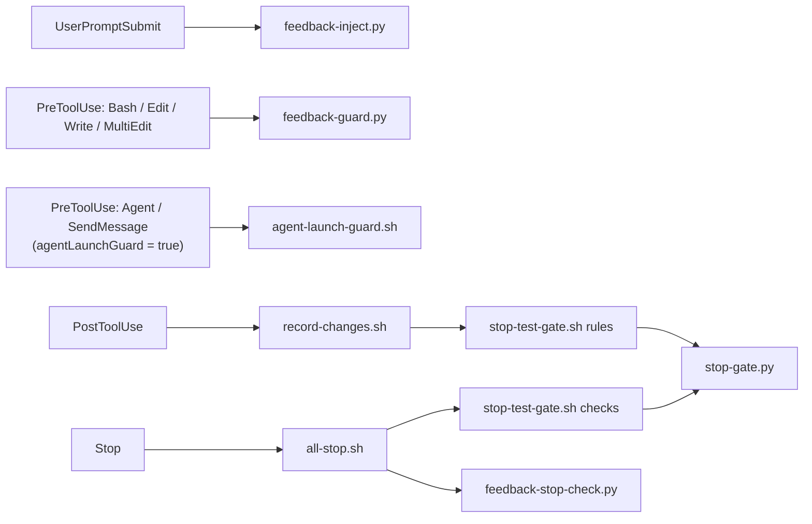

# feedback-gate

[日本語](README_ja.md)

A Claude Code plugin made of function hooks. It does three things:

- Injects your feedback rules (`~/.claude/feedback/*.md`) into each prompt and enforces them on tool calls and when Claude stops.
- Runs per-project quality gates (lint, tests, etc.) defined in `.claude/gate.yaml` after file edits and when Claude stops.
- Sends a desktop notification when Claude waits for you or stops (macOS).

## Hooks

The hooks are registered in `hooks/register.ts` and call the scripts bundled under `scripts/`.

| Event | Script | Role |
| --- | --- | --- |
| SessionStart | `reset-gate.sh` | Clears this session's gate state on `startup` / `clear`; keeps it on resume / compact. |
| UserPromptSubmit | (reads the rules file) + `feedback-inject.py` | Adds the rules file (your `rulesFile` if it exists, otherwise the bundled `rules/feedback_rules.md`) and the confirmed feedback rules (`count >= 3`) to the context. |
| PreToolUse (Bash / Edit / Write / MultiEdit) | `feedback-guard.py` | Evaluates `pre_bash` / `pre_edit` enforce entries; denies, asks or warns by `count`. |
| PostToolUse (Write / Edit / MultiEdit) | `record-changes.sh`, then `stop-test-gate.sh rules` | Records changed files, then runs the matching rules of `.claude/gate.yaml` (via `stop-gate.py`). |
| PreToolUse (Agent / SendMessage), opt-in | `agent-launch-guard.sh` | Only when `agentLaunchGuard` is `true`: asks before sending instructions to a subagent, showing the full text. |
| Notification | `notification.sh notify` | Desktop notification when Claude waits for you (needs `terminal-notifier`, macOS). |
| Stop | `all-stop.sh` | Runs, in order: `stop-test-gate.sh checks`, `feedback-stop-check.py`, then `notification.sh stop`. |
| SubagentStop | `stop-test-gate.sh checks`, `feedback-stop-check.py` | Same gate and `stop_check` rules for subagents. |

### Agent launch guard (optional)

`agent-launch-guard.sh` is registered only when the `agentLaunchGuard` option (`userConfig`) is `true`. It is `false` by default. When enabled, it runs on PreToolUse for `Agent` and `SendMessage` and returns `ask`, putting the full text that would be sent into the confirmation reason so you can review it before the subagent receives it:

- `Agent`: asks when `subagent_type` is `code-implementer`, showing the `prompt`.
- `SendMessage`: asks for every recipient except `git-operator`, showing the `message`.

Anything else passes through to the normal permission flow. The target agent types and the allowed recipients are the `ASK_AGENT_TYPES` and `ALLOW_RECIPIENTS` arrays at the top of `scripts/agent-launch-guard.sh`.

To enable it, turn on `agentLaunchGuard` on the settings screen shown when you install the plugin with `/plugin`, or change it later in the `/config` menu (the plugin's `agentLaunchGuard` row).



## Install

```
/plugin install feedback-gate --marketplace nonchan7720/claude-hook-gate
```

Answer `y` to add the marketplace, then choose the scope.

## Requirements

- `python3`
- `bash`
- `jq` (some shell scripts fall back to `grep`/`sed` when it is missing, but `notification.sh` and `agent-launch-guard.sh` use it directly)
- `dogwood` (optional; an AWS tool, source at <https://github.com/dogwood-policy/dogwood>). Build and install it with `cargo install --git https://github.com/dogwood-policy/dogwood amzn-dogwood-cli` (crate `amzn-dogwood-cli`, binary `dogwood`). The gate scripts use it to decide whether each `.claude/gate.yaml` command runs now or is deferred. It is looked up in `DOGWOOD_BIN`, `PATH`, `~/.cargo/bin/dogwood` and `~/.local/share/mise/shims/dogwood`, in that order. When it is not found, commands under the bundled default policy run every time, while commands under a `policy:` you set are skipped and deferred.

## What it reads

- `.claude/gate.yaml` in the project (opt-in: without it, the gate scripts do nothing). The format is described by `scripts/gate.schema.json`; the default policy is in `scripts/dogwood/`.
- `~/.claude/feedback/*.md`: feedback rules with frontmatter (`name`, `description`, `type`, `count`, optional `enforce`). Rules with `count >= 3` are injected and enforced. Override the directory with `CLAUDE_FEEDBACK_DIR`.
- The rules file, added to the context on every prompt. By default the bundled `rules/feedback_rules.md` is used. To replace it entirely, put your own file at the `rulesFile` path (default `~/.claude/feedback-gate/feedback_rules.md`, configurable in the plugin settings; a leading `~` is expanded). If that file exists it is used instead of the bundled one (never both). Avoid `~/.claude/rules/`: Claude Code loads that directory itself, so the rules would be injected twice.

State files (changed files, attempt counters, command logs) are written under the project's `.claude/.gate-status/` directory (`gate.yaml` stays directly under `.claude/`). Add `.claude/.gate-status/` to the project's `.gitignore`. State files left by older versions directly under `.claude/` (and `.claude/hooks/logs/`) are removed automatically at session start.

## Development

Requires [Bun](https://bun.sh).

```
bun install          # install dev dependencies
bun run lint         # Biome (lint + format check); `bun run format` fixes
bun run typecheck    # tsc --noEmit
```

CI (`.github/workflows/ci.yml`) runs `bun run lint` and `bun run typecheck` on every pull request.

## Releases

Versions are managed by [release-please](https://github.com/googleapis/release-please). Write commit messages (and PR titles) as [Conventional Commits](https://www.conventionalcommits.org/) (`feat:`, `fix:`, `refactor:`, `chore:`, ...): on every push to `main` the "Release Please" workflow opens or updates a release PR that bumps the version in `package.json`, `.claude-plugin/plugin.json` and `.claude-plugin/marketplace.json` and updates `CHANGELOG.md`; merging it tags the release. The workflow uses the default `GITHUB_TOKEN` (no personal access token), so the release PR does not trigger CI on its own. If you have required status checks, re-run them or push an empty commit by hand.
