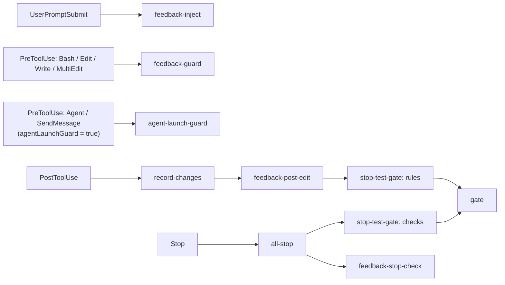

# feedback-gate

[日本語](README_ja.md)

A Claude Code plugin made of function hooks. It does three things:

- Injects your feedback rules (`~/.claude/feedback/*.md`) into each prompt and enforces them on tool calls and when Claude stops.
- Runs per-project quality gates (lint, tests, etc.) defined in `.claude/gate.yaml` after file edits and when Claude stops.
- Sends a desktop notification when Claude waits for you or stops (macOS).

## Hooks

The hooks are registered in `src/register.ts` (bundled into `hooks/register.js` by CI; that bundle is what Claude Code loads) and call the TypeScript modules under `src/`.

| Event | Module | Role |
| --- | --- | --- |
| SessionStart | `src/reset-gate.ts` | Clears this session's gate state on `startup` / `clear`; keeps it on resume / compact. |
| UserPromptSubmit | `src/rules-file.ts` + `src/feedback-inject.ts` | Adds the rules file (your `rulesFile` if it exists, otherwise the bundled `rules/feedback_rules.md`, or `rules/feedback_rules.en.md` when the language is English) and the confirmed feedback rules (`count >= 3`) to the context. |
| PreToolUse (Bash / Edit / Write / MultiEdit) | `src/feedback-guard.ts` | Evaluates `pre_bash` / `pre_edit` enforce entries; denies, asks or warns by `count`. |
| PostToolUse (Write / Edit / MultiEdit) | `src/record-changes.ts`, `src/feedback-post-edit.ts`, then `src/stop-test-gate.ts` (`rules`) | Records changed files, evaluates `post_edit` enforce entries against the edited file as a whole (blocks or warns by `count`), then runs the matching rules of `.claude/gate.yaml` (via `src/gate.ts`). |
| PreToolUse (Bash) | `src/bash-changes.ts` (`bashStarted`), before `feedback-guard` | Notes when the command started (`bash_started.<id>.json`). |
| PostToolUse (Bash) | `src/bash-changes.ts`, then `src/stop-test-gate.ts` (`rules`) | Records only the files the command actually rewrote (git-modified or untracked files whose mtime is at or after the command start), then runs the matching rules only if something was recorded. Git history / working-tree operations (rebase / checkout / merge etc.) are never recorded. |
| PreToolUse (Agent / SendMessage), opt-in | `src/agent-launch-guard.ts` | Only when `agentLaunchGuard` is `true`: asks before sending instructions to a subagent, showing the full text. |
| Notification | `src/notification.ts` (`notify`) | Desktop notification when Claude waits for you (needs `terminal-notifier`, macOS). |
| Stop | `src/all-stop.ts` | Runs, in order: the gate `checks` phase, `src/feedback-stop-check.ts`, then the `stop` notification. |
| SubagentStop | gate `checks` phase, `src/feedback-stop-check.ts` | Same gate and `stop_check` rules for subagents. |

### Agent launch guard (optional)

`src/agent-launch-guard.ts` is active only when the `agentLaunchGuard` option (`userConfig`) is `true`. It is `false` by default. When enabled, it runs on PreToolUse for `Agent` and `SendMessage` and returns `ask`, putting the full text that would be sent into the confirmation reason so you can review it before the subagent receives it:

- `Agent`: asks when `subagent_type` is `code-implementer`, showing the `prompt`.
- `SendMessage`: asks for every recipient except `git-operator`, showing the `message`.

Anything else passes through to the normal permission flow. The target agent types and the allowed recipients are the `ASK_AGENT_TYPES` and `ALLOW_RECIPIENTS` arrays at the top of `src/agent-launch-guard.ts`.

To enable it, turn on `agentLaunchGuard` on the settings screen shown when you install the plugin with `/plugin`, or change it later in the `/config` menu (the plugin's `agentLaunchGuard` row).

### Language of the messages

Everything the hooks print (the feedback rules injected into the context, the block / warn reasons, the gate results, the band and the status line, the desktop notifications, the `/correct` report and the bundled rules file) is available in English and Japanese. The `language` option (`userConfig`, set on the `/plugin` install screen or later in `/config`) chooses it:

- `auto` (default): follow the OS language. The hooks read `FEEDBACK_GATE_LANG` (a plugin-specific override, `ja` or `en`), then `LC_ALL`, `LC_MESSAGES` and `LANG`, and use the first one that has a value: Japanese when it starts with `ja` (e.g. `ja_JP.UTF-8`), English for anything else (`en_US.UTF-8`, `C`, `POSIX`, ...). When none of them is set, English.
- `ja` / `en`: always that language, whatever the environment.

The resolution lives in `src/i18n.ts` and the texts in `src/messages.ts`. The examples below show the English texts; with Japanese you get the Japanese ones (e.g. `[gate] 実行中:` for `[gate] running:` and `[gate] 完了:` for `[gate] done:`). Your own `rulesFile` and the `message` of your feedback rules are shown as you wrote them, in any language.



## Commands

### `/correct`

Fixes a repeated mistake at the layer that works best. It aggregates the feedback rules (`~/.claude/feedback/*.md` and `<project>/.claude/feedback/*.md`) and the violation log (`~/.claude/feedback/.violations.jsonl`), then proposes how to tighten them. The command is registered on `session.start` by `src/register.ts`; the logic is in `src/correct.ts`.

```
/correct [--window 30d] [--min 2] [apply]
```

- `--window`: how far back to count violations, `Nd` or `Nh` (default `30d`).
- `--min`: the minimum number of violations in the window before a proposal is made (default `2`).
- `apply`: write the `bump` proposals to the rule files (see below). Without it nothing is changed.

Unknown arguments are ignored. There are four kinds of proposals, listed in this order:

| Kind | When | Proposal |
| --- | --- | --- |
| `bump` | An active rule has at least `--min` violations in the window. | `count` 1-2: raise to 3 (confirmed rule). `count` 3-4 with at least `--min` `ask` / `block` violations in the window: raise to 5 (`deny`). `count` >= 5 is never proposed. |
| `enforce` | An active rule has `count >= 3` but no `enforce`, so no hook can detect it (and the violation log never sees it). | Add `enforce` entries; a template for the four events is shown. |
| `stale` | An active rule has `count >= 3` and `enforce`, but has never appeared in the violation log. | Check that the `enforce` works and the rule is not out of date. |
| `expired` | A rule file is inactive because of `expires`, `projects` or `when_exists`. | Delete or update it. |

`apply` rewrites only the `count:` line inside the frontmatter of the `bump` rules, and lists the changed files. Nothing else in the files is touched. `enforce` (and `stale` / `expired`) are proposals only: Claude is told to show them to you and to ask before editing any file.

## Install

```
/plugin install feedback-gate --marketplace nonchan7720/claude-hook-gate
```

Answer `y` to add the marketplace, then choose the scope.

## Requirements

Nothing to install: the hooks are plain TypeScript, bundled into one JavaScript file that Claude Code runs itself (no Python, bash or jq).

- `terminal-notifier` (optional, macOS): needed only for the desktop notifications.
- `dogwood` (optional; an AWS tool, source at <https://github.com/dogwood-policy/dogwood>). Build and install it with `cargo install --git https://github.com/dogwood-policy/dogwood amzn-dogwood-cli` (crate `amzn-dogwood-cli`, binary `dogwood`). The gate uses it to decide whether each `.claude/gate.yaml` command runs now or is deferred. It is looked up in `DOGWOOD_BIN`, `PATH`, `~/.cargo/bin/dogwood` and `~/.local/share/mise/shims/dogwood`, in that order. When it is not found, commands under the bundled default policy run every time, while commands under a `policy:` you set are skipped and deferred.

## What it reads

- `.claude/gate.yaml` in the project (opt-in: without it, the gate does nothing). The format is described by `scripts/gate.schema.json`; the default policy is in `scripts/dogwood/`.
- `~/.claude/feedback/*.md`: feedback rules with frontmatter (`name`, `description`, `type`, `count`, optional `enforce`, `expires`, `projects`, `when_exists`). Rules with `count >= 3` are injected and enforced. `expires` (`YYYY-MM-DD`, valid through the end of that day in UTC, or an ISO 8601 datetime) turns a rule off after that point; `projects` (a string or list of globs matched against the project directory's absolute path, a leading `~` expands to `HOME`) limits it to matching projects; `when_exists` (a string or list of globs relative to the project root) limits it to projects where at least one exists. A rule is active only when all three that are set are satisfied; an unparsable `expires` is ignored. These filters apply only to the merged global + project lookup, and an expired project rule also hides the global rule of the same name. Override the directory with `CLAUDE_FEEDBACK_DIR`. The project's `.claude/feedback/*.md` is read as well; when a project rule has the same `name` as a global one, the project rule takes precedence.
- The rules file, added to the context on every prompt. By default the bundled `rules/feedback_rules.md` (Japanese) or `rules/feedback_rules.en.md` (English) is used, by the language above. To replace it entirely, put your own file at the `rulesFile` path (default `~/.claude/feedback-gate/feedback_rules.md`, configurable in the plugin settings; a leading `~` is expanded). If that file exists it is used instead of the bundled one (never both, whatever the language). Avoid `~/.claude/rules/`: Claude Code loads that directory itself, so the rules would be injected twice.

State files (changed files, attempt counters, command logs) are written under the project's `.claude/.gate-status/` directory (`gate.yaml` stays directly under `.claude/`). Add `.claude/.gate-status/` to the project's `.gitignore`. State files left by older versions directly under `.claude/` (and `.claude/hooks/logs/`) are removed automatically at session start. `bash_started.*.json` there holds the start time of the Bash command in flight, used to tell which files that command rewrote.

While gate commands run, a band above the prompt shows what is running, one item per line, e.g.

```
[gate] running:
  typecheck ✓ (0.7s)
  lint ✗ (0.2s)
  test $ bun run test (8s)
```

Finished commands stay in start order with `✓` for success or `✗` for failure and their fixed duration; a running one shows `name $ cmd` and its elapsed seconds, refreshed every second. A multi-line command is folded to its first line, and a long one is cut with ` ...` so each line stays around 80 characters. The band yields to the engine's own band while a survey is shown.

The band is shared by the agents of one session (the main agent and its subagents): their running commands are merged into one list, e.g. `  lint $ bun lint (3s)` and `  test $ bun test waiting (2s)` under `[gate] running:`. `waiting` marks a command that is waiting for the same run in another agent (see below). The band disappears only when every agent of the session has finished; while another agent of the session is still running, its list stays. Other Claude Code sessions open on the same project (for example in another terminal) are not shown, and the one-line summary below is kept per session too.

When everything has finished, the band goes away and the result of that round is left on the one-line status line instead, as counts only, e.g. `[gate] done: ✓ 5 / ✗ 1 (81.0s)` (`✗` is left out when nothing failed, `✓` when nothing passed; the seconds run from the first start to the last finish, not the sum, since checks run in parallel; check names are not shown, see the Stop hook output for which one failed. The status line cannot hold line breaks or long text, so it stays short). It stays until the next gate command starts running and the band appears again. Feedback checks still use the status line while they run: `[feedback-guard] evaluating: <rule>` or `[feedback-stop-check] checking: <rule> (<file>)`, cleared when the hook finishes.

### Sharing runs between agents

When several agents (the main session and subagents) run the same command at the same time, the gate starts it once. A command is the same when the root, the cwd, the `cmd` and the environment passed to it all match; the variable that identifies the agent (`CLAUDE_AGENT_ID`) and the list of target files (`CLAUDE_GATE_FILES`) are ignored. The file list is handled separately because it can differ per agent. The agent that comes later looks at the runs in progress under the same conditions: if one of them targets every file of its own list (an empty list is contained in any), it does not start the command again but waits for that run and receives the same result (exit status, output, timeout). The result is then handled as if that agent had run it itself: it is recorded in its own trace and log directory, it consumes a deferred entry with the same key, and it counts for its phase result. A finished run is never reused; only overlapping runs are merged. Coordination goes through files under `.claude/.gate-status/shared/` (a lock directory per command and file list; a lock older than the command's `timeout` is treated as dead and taken over), because the hooks of different agents are not guaranteed to run in the same process.

To opt a command out, set `share: false` on its `run` element (`{cmd, name, timeout, share, files}`):

```yaml
run:
  - { cmd: "bun test", name: test, share: false }
```

A command that does not use the target files (such as `go test ./...`, which runs everything regardless of the list) can set `files: false`. Its file list is then treated as empty when deciding whether to share, so it is shared even when the agents changed different files. `CLAUDE_GATE_FILES` is still passed to the command as before. When combined with `share: false`, `share: false` wins and nothing is shared.

```yaml
run:
  - cmd: go test ./...
    name: test
    files: false
```

### Success report

When the `checks` phase (Stop / SubagentStop) actually ran at least one command and all of them passed, the gate blocks the stop once and returns a summary as the reason, e.g. `[gate] All checks passed: lint ✓ / typecheck ✓ / test ✓. Report this result to the user and finish.`, so the agent can report the result and finish instead of waiting for you to say it passed. The stop right after such a report (`stop_hook_active`) runs no gate command and passes. Nothing is reported when no command ran, when `stop_hook_active` is true (a continuation after a failure block), or when it is turned off with a top-level `report_success: false` in `.claude/gate.yaml` (default: on). Failures block as before.

## Development

Requires [Bun](https://bun.sh). The hook module runs inside Claude Code, which only resolves relative imports and `claude-code`; so the source in `src/` (plus the `yaml` package) is bundled into `hooks/register.js`. `hooks/hooks.json` points at that bundle. All file and process access goes through the engine's `$` API (`$.fs`, `$.process`, `$.env`, `$.session`), wrapped by the `Io` interface in `src/io.ts`; the tests run the same code against Node's `fs` / `child_process`.

```
bun install          # install dev dependencies
bun run lint         # Biome (lint + format check); `bun run format` fixes
bun run typecheck    # tsc --noEmit
bun run test         # bun test (tests/*.spec.ts)
bun run build        # bundle src/register.ts -> hooks/register.js
bun run test:plugin  # build, then run hooks/register.test.ts on the real engine (needs the `claude` CLI)
```

The bundle `hooks/register.js` is generated and committed by CI on the pull request; contributors do not commit it (it is not in the repository until CI adds it). The "Build bundle" workflow builds it on every pull request (same-repo branches) and pushes a `chore: build bundle` commit to the branch, adding the file or updating it if it changed. Run `bun run build` to produce it locally (e.g. for `bun run test:plugin`) and leave it uncommitted. Do not edit it by hand. `scripts/build.ts` fails the build if the bundle imports anything but relative paths and `claude-code`.

Dependencies have a 7-day freeze period: `bunfig.toml` sets `minimumReleaseAge` so `bun install` only resolves versions published at least 7 days ago, and Dependabot (`.github/dependabot.yml`) waits 7 days (`cooldown`) before proposing npm or GitHub Actions updates. Actions are pinned to commit SHAs.

### Releases

Versions are managed by [release-please](https://github.com/googleapis/release-please). Write commit messages (and PR titles) as [Conventional Commits](https://www.conventionalcommits.org/) (`feat:`, `fix:`, `refactor:`, `chore:`, ...): on every push to `main` the "Release Please" workflow opens or updates a release PR that bumps the version in `package.json`, `.claude-plugin/plugin.json` and `.claude-plugin/marketplace.json` and updates `CHANGELOG.md`; merging it tags the release. Both workflows use the default `GITHUB_TOKEN` (no personal access token), so commits made by the bot and the release-please PR do not trigger CI on their own. If you have required status checks, re-run them or push an empty commit by hand.
