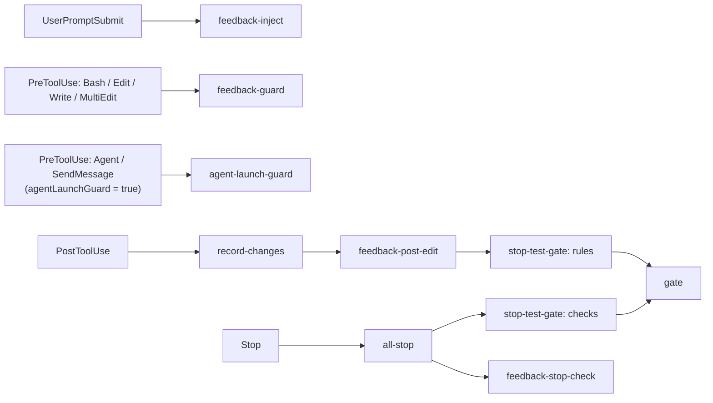

# feedback-gate

[English](README.md)

function hooks で作られた Claude Code プラグインです。次の 3 つを行います。

- フィードバックルール（`~/.claude/feedback/*.md`）を各プロンプトに注入し、ツール呼び出し時と停止時に強制する。
- プロジェクトごとの品質ゲート（lint・テストなど、`.claude/gate.yaml` で定義）を、ファイル編集後と停止時に実行する。
- 確認待ちのときと停止時にデスクトップ通知を出す（macOS）。

## フック

フックは `src/register.ts` で登録され（CI が `hooks/register.js` にバンドルし、それを Claude Code が読み込みます）、`src/` の TypeScript モジュールを呼びます。

| イベント | モジュール | 役割 |
| --- | --- | --- |
| SessionStart | `src/reset-gate.ts` | `startup` / `clear` のときだけ自セッションのゲート状態を消す。resume / compact では消さない。 |
| UserPromptSubmit | `src/rules-file.ts` + `src/feedback-inject.ts` | ルールファイル（`rulesFile` のファイルがあればそれ、無ければ同梱の `rules/feedback_rules.md`。言語が英語なら `rules/feedback_rules.en.md`）と確定済みフィードバックルール（`count >= 3`）をコンテキストに追加する。 |
| PreToolUse（Bash / Edit / Write / MultiEdit） | `src/feedback-guard.ts` | `pre_bash` / `pre_edit` の enforce を評価し、`count` に応じて deny / ask / warn する。 |
| PostToolUse（Write / Edit / MultiEdit） | `src/record-changes.ts` → `src/feedback-post-edit.ts` → `src/stop-test-gate.ts`（`rules`） | 変更ファイルを記録し、`post_edit` の enforce を編集後のファイル全体に対して評価（`count` に応じて block / warn）したあと、`.claude/gate.yaml` の該当ルールを実行する（`src/gate.ts` 経由）。 |
| PreToolUse（Bash） | `src/bash-changes.ts`（`bashStarted`）。`feedback-guard` の前 | コマンドの開始時刻を控える（`bash_started.<id>.json`）。 |
| PostToolUse（Bash） | `src/bash-changes.ts` → `src/stop-test-gate.ts`（`rules`） | コマンドが実際に書き換えたファイル（git の変更・未追跡ファイルのうち、mtime がコマンド開始以降のもの）だけを記録し、記録があったときだけ該当ルールを実行する。git の履歴・作業ツリー操作（rebase / checkout / merge など）は記録しない。 |
| PreToolUse（Agent / SendMessage）、任意 | `src/agent-launch-guard.ts` | `agentLaunchGuard` が `true` のときだけ有効。サブエージェントへ指示を送る前に、送信本文を見せて確認する。 |
| Notification | `src/notification.ts`（`notify`） | 確認待ちのときにデスクトップ通知（`terminal-notifier` が必要、macOS）。 |
| Stop | `src/all-stop.ts` | ゲートの `checks` フェーズ、`src/feedback-stop-check.ts`、`stop` 通知を順に実行する。 |
| SubagentStop | ゲートの `checks` フェーズ、`src/feedback-stop-check.ts` | サブエージェント向けの同じゲートと `stop_check` ルール。 |

### エージェント起動ガード（任意）

`src/agent-launch-guard.ts` は、`userConfig` の `agentLaunchGuard` を `true` にしたときだけ有効になります（既定は `false`）。有効にすると、`Agent` と `SendMessage` の PreToolUse で `ask` を返し、送信しようとしている本文を確認理由にそのまま載せるので、サブエージェントに渡る前に内容を確認できます。

- `Agent`: `subagent_type` が `code-implementer` のとき、`prompt` を見せて確認する。
- `SendMessage`: 宛先が `git-operator` 以外のとき、`message` を見せて確認する。

どちらにも該当しなければ何も出力せず、通常のパーミッション判定に委ねます。対象のエージェント種別と許可する宛先は `src/agent-launch-guard.ts` 冒頭の `ASK_AGENT_TYPES` / `ALLOW_RECIPIENTS` です。

有効化するには、`/plugin` でインストールするときに表示される設定画面で `agentLaunchGuard` をオンにするか、後から `/config` メニューのこのプラグインの `agentLaunchGuard` の行で切り替えます。

### メッセージの言語

hook が出すもの（コンテキストに注入するフィードバックルール、block / warn の理由、gate の結果、帯とステータス行、デスクトップ通知、`/correct` の報告、同梱のルールファイル）は日本語と英語を選べます。`userConfig` の `language`（`/plugin` のインストール時の設定画面か、後から `/config` で変更）で決めます。

- `auto`（既定）: OS の言語設定に従います。環境変数 `FEEDBACK_GATE_LANG`（このプラグイン専用の上書き。`ja` か `en`）、`LC_ALL`、`LC_MESSAGES`、`LANG` の順に最初に値のあるものを見て、`ja` で始まれば日本語（例: `ja_JP.UTF-8`）、それ以外（`en_US.UTF-8`、`C`、`POSIX` など）は英語です。どれも無ければ英語になります。
- `ja` / `en`: 環境によらず常にその言語。

判定は `src/i18n.ts`、文面は `src/messages.ts` にあります。この README の例は日本語の文面です（英語では `[gate] 実行中:` が `[gate] running:`、`[gate] 完了:` が `[gate] done:` などになります）。自分で置いた `rulesFile` と、フィードバックルールの `message` は、どの言語でも書いたとおりに出ます。



## コマンド

### `/correct`

繰り返す間違いを、最も効く層で直すためのコマンドです。feedback ルール（`~/.claude/feedback/*.md` と `<project>/.claude/feedback/*.md`）と違反ログ（`~/.claude/feedback/.violations.jsonl`）を集計し、締め直しの提案を出します。`src/register.ts` が `session.start` で登録し、ロジックは `src/correct.ts` にあります。

```
/correct [--window 30d] [--min 2] [apply]
```

- `--window`: 違反を数える期間。`Nd` または `Nh`（既定 `30d`）。
- `--min`: 提案を出す窓内の最小違反回数（既定 `2`）。
- `apply`: `bump` の提案をルールファイルに書き込みます（下記）。付けなければ何も変更しません。

不明な引数は無視します。提案は次の 4 種類で、この順に並びます。

| 種類 | 条件 | 提案 |
| --- | --- | --- |
| `bump` | 有効なルールの窓内の違反が `--min` 回以上。 | `count` 1〜2 は 3 へ（確定ルールに昇格）。`count` 3〜4 で窓内の `ask` / `block` が `--min` 回以上なら 5（`deny`）へ。`count` 5 以上は提案しません。 |
| `enforce` | 有効なルールが `count >= 3` なのに `enforce` が無い。hook が検知できず、違反ログにも出ない。 | `enforce` の追加。4 イベント分の雛形を添えます。 |
| `stale` | 有効なルールが `count >= 3` で `enforce` もあるが、違反ログに一度も出ていない。 | `enforce` が効いているか、ルールが古くなっていないかの確認。 |
| `expired` | `expires` / `projects` / `when_exists` のいずれかで無効になっているルールファイル。 | 削除または更新。 |

`apply` が書き換えるのは、`bump` 対象ファイルの frontmatter 内の `count:` 行だけです。変更したファイルの一覧を表示し、それ以外は一切触りません。`enforce`（と `stale` / `expired`）は提案のみで、Claude はそれをユーザーに提示し、ファイルを書き換える前に確認します。

## インストール

```
/plugin install feedback-gate --marketplace nonchan7720/claude-hook-gate
```

マーケットプレイスの追加を聞かれたら `y` と答え、スコープを選択します。

## 前提

インストールするものはありません。フックは素の TypeScript で、1 つの JavaScript にバンドルして Claude Code が直接実行します（Python・bash・jq は不要）。

- `terminal-notifier`（任意、macOS）: デスクトップ通知にだけ必要です。
- `dogwood`（任意。AWS のツールで、ソースは <https://github.com/dogwood-policy/dogwood>）。`cargo install --git https://github.com/dogwood-policy/dogwood amzn-dogwood-cli` でビルド・インストールできます（crate 名は `amzn-dogwood-cli`、バイナリ名は `dogwood`）。`.claude/gate.yaml` の各コマンドを今実行するか後回しにするかの判定に使います。`DOGWOOD_BIN`、`PATH`、`~/.cargo/bin/dogwood`、`~/.local/share/mise/shims/dogwood` の順に探します。見つからない場合、同梱の既定ポリシーが適用されるコマンドは毎回実行され、`policy:` を指定したコマンドは実行されずに後回しになります。

## 読み込むもの

- プロジェクトの `.claude/gate.yaml`（オプトイン。無ければゲートは何もしません）。書式は `scripts/gate.schema.json`、既定ポリシーは `scripts/dogwood/` にあります。
- `~/.claude/feedback/*.md`: frontmatter（`name`、`description`、`type`、`count`、任意で `enforce`、`expires`、`projects`、`when_exists`）付きのフィードバックルール。`count >= 3` のルールが注入・強制されます。`expires`（`YYYY-MM-DD` ならその日の終わり（UTC）まで有効、または ISO 8601 日時）を過ぎたルールは無効になり、`projects`（プロジェクトディレクトリの絶対パスにマッチする glob の文字列または配列。先頭の `~` は `HOME` に展開）はマッチするプロジェクトに、`when_exists`（プロジェクトルート相対の glob の文字列または配列）は1つでも存在するプロジェクトに適用を絞ります。指定したキーすべてを満たしたときだけ有効で、解釈できない `expires` は無視されます。これらの絞り込みはグローバルとプロジェクトをマージして読む経路にだけかかり、プロジェクト側の同名ルールが無効ならグローバル側も使われません。ディレクトリは `CLAUDE_FEEDBACK_DIR` で変更できます。プロジェクトの `.claude/feedback/*.md` も読み込まれ、グローバルと同じ `name` のルールがあればプロジェクト側が優先されます。
- ルールファイル: プロンプトごとにコンテキストへ追加されます。既定では同梱の `rules/feedback_rules.md`（日本語）か `rules/feedback_rules.en.md`（英語）を、上記の言語に応じて使います。丸ごと差し替えるには、`rulesFile` のパス（既定は `~/.claude/feedback-gate/feedback_rules.md`。プラグイン設定で変更可、先頭の `~` は展開されます）に自分のファイルを置いてください。そのファイルがあれば言語によらず同梱版の代わりに使われます（両方は入りません）。置き場所に `~/.claude/rules/` は避けてください。Claude Code 自身がこのディレクトリを読み込むため、二重に入ってしまいます。

状態ファイル（変更ファイル、試行回数、コマンドのログ）はプロジェクトの `.claude/.gate-status/` 配下に書かれます（`gate.yaml` は従来どおり `.claude/` 直下）。プロジェクトの `.gitignore` に `.claude/.gate-status/` を足してください。旧版が `.claude/` 直下（および `.claude/hooks/logs/`）に残した状態ファイルは、セッション開始時に自動で削除されます。`bash_started.*.json` は実行中の Bash コマンドの開始時刻で、そのコマンドが書き換えたファイルを見分けるために使います。

gate のコマンドが走っている間、プロンプトの上の帯に実行中の内容を 1 項目 1 行で表示します。例:

```
[gate] 実行中:
  typecheck ✓ (0.7s)
  lint ✗ (0.2s)
  test $ bun run test (8s)
```

終わったコマンドも実行開始順のまま、成功は `✓`・失敗は `✗` と固定された所要時間付きで残ります。実行中のコマンドは `名前 $ コマンド` と経過秒（1 秒ごとに更新）を表示します。複数行のコマンドは先頭の 1 行に畳み、長いコマンドは ` ...` で省略して、1 行がおおむね 80 文字に収まります。アンケートが表示されている間は、帯をエンジン側に譲ります。

帯は同じセッションのエージェント（メインとそのサブエージェント）で共有され、実行中のコマンドを 1 つの一覧にまとめて表示します（例: `[gate] 実行中:` の下に `  lint $ bun lint (3s)` と `  test $ bun test 待機中 (2s)` の 2 行）。`待機中` は、別のエージェントで走っている同じ実行の完了を待っているコマンドです（下記）。帯が消えるのは同じセッションの全エージェントの実行が終わったときだけで、同じセッションの他のエージェントがまだ実行中の間はその一覧が残ります。同じプロジェクトを開いている別の Claude Code セッション（別ターミナルなど）の分は表示されず、下記の 1 行サマリもセッションごとに保持されます。

すべて終わると帯は消え、代わりにその回の結果が 1 行でステータス行に残ります。件数だけを出します。例: `[gate] 完了: ✓ 5 / ✗ 1 (81.0s)`（失敗が 0 件なら `✗` は、成功が 0 件なら `✓` は付けません。秒数は並列実行なので合計ではなく、最初の開始から最後の完了までの経過時間です。チェック名は出さないので、どれが落ちたかは Stop hook の出力で確認してください。ステータス行は改行を描けず幅も限られるため、短く保ちます）。次の gate のコマンドが走り始めて帯が出るまで残ります。feedback の検証は従来どおり、走っている間だけステータス行に `[feedback-guard] 評価中: <rule>`、`[feedback-stop-check] 検査中: <rule> (<file>)` と表示し、hook が終わると消えます。

### エージェント間の実行共有

複数のエージェント（メインとサブエージェント）が同時に同じコマンドを実行しようとしたとき、gate は実体を 1 回だけ起動します。「同じ」とは、root・cwd・`cmd`・コマンドに渡す環境変数がすべて一致することで、エージェント識別用の変数（`CLAUDE_AGENT_ID`）と対象ファイル一覧（`CLAUDE_GATE_FILES`）は比較から除きます。対象ファイル一覧はエージェントごとに違いうるので、別に扱います。後から来たエージェントは、同じ条件で進行中の実行のうち、その対象ファイルが自分の対象ファイルをすべて含むもの（自分の一覧が空ならどれでも）があれば、起動し直さず、その完了を待って同じ結果（終了コード・出力・タイムアウト）を受け取ります。受け取った側も自分で実行した場合と同じに扱います（自分の trace とログディレクトリに記録し、同じキーの控えを消化し、フェーズの成否に反映します）。完了済みの結果は再利用せず、重なった実行だけをまとめます。エージェントごとの hook が同じプロセスで動く保証はないため、調停は `.claude/.gate-status/shared/` 配下のファイル（コマンドと対象ファイル一覧の組ごとのロックディレクトリ。コマンドの `timeout` を過ぎたロックは落ちたものとみなして奪い直す）で行います。

共有したくないコマンドは、`run` 要素に `share: false` を書きます（`{cmd, name, timeout, share, files}`）。

```yaml
run:
  - { cmd: "bun test", name: test, share: false }
```

対象ファイルを使わないコマンド（`go test ./...` のようにファイル一覧に関係なく全体を走らせるもの）は、`files: false` を書くと、共有の判定上の対象ファイルを空として扱い、エージェントごとに対象ファイルが違っても共有されます。`CLAUDE_GATE_FILES` 自体は従来どおりコマンドに渡ります。`share: false` と併記した場合は `share: false` が優先され、共有しません。

```yaml
run:
  - cmd: go test ./...
    name: test
    files: false
```

### 成功報告

checks フェーズ（Stop / SubagentStop）で 1 件以上のコマンドが実際に実行され、すべて成功したとき、gate は Stop を 1 回だけブロックして結果の要約を reason として返します（例: `[gate] 検証がすべて通りました: lint ✓ / typecheck ✓ / test ✓。この結果をユーザーに報告して終了してください。`）。エージェントはこれを受けて、ユーザーが「通ってそう」と伝えなくても完了報告して止まれます。報告でブロックした直後の Stop（`stop_hook_active`）では gate のコマンドを一切実行せず通します。何も実行されなかったとき、`stop_hook_active` が true のとき（失敗ブロックの続き）、`.claude/gate.yaml` のトップレベルに `report_success: false` を書いたとき（既定は有効）は報告しません。失敗時のブロックは従来どおりです。

## 開発

[Bun](https://bun.sh) が必要です。フックのモジュールは Claude Code の中で動き、相対 import と `claude-code` しか解決できないため、`src/` のソース（と `yaml` パッケージ）を `hooks/register.js` にバンドルします。`hooks/hooks.json` はこのバンドルを指します。ファイルやプロセスへのアクセスはすべてエンジンの `$` API（`$.fs`、`$.process`、`$.env`、`$.session`）を、`src/io.ts` の `Io` インターフェース越しに使います。テストは同じコードを Node の `fs` / `child_process` の上で動かします。

```
bun install          # 開発用の依存を入れる
bun run lint         # Biome（lint とフォーマットの検査）。`bun run format` で自動修正
bun run typecheck    # tsc --noEmit
bun run test         # bun test（tests/*.spec.ts）
bun run build        # src/register.ts を hooks/register.js にバンドル
bun run test:plugin  # ビルドしてから、実エンジンで hooks/register.test.ts を実行（`claude` CLI が必要）
```

バンドル `hooks/register.js` は、プルリクエスト上で CI が生成してコミットします。貢献者がコミットする必要はありません（CI が追加するまでリポジトリには入っていません）。「Build bundle」ワークフローが、プルリクエスト（同一リポジトリのブランチ）ごとにバンドルを作り、ファイルの追加または変更があれば `chore: build bundle` コミットをそのブランチへ push します。ローカルで必要なとき（`bun run test:plugin` など）は `bun run build` で作れますが、コミットしないでください。手で編集もしないでください。`scripts/build.ts` は、バンドルが相対パスと `claude-code` 以外を import していたらビルドを失敗させます。

依存には 7 日間のフリーズ期間を設けています。`bunfig.toml` の `minimumReleaseAge` により、`bun install` は公開から 7 日以上経ったバージョンだけを解決します。Dependabot（`.github/dependabot.yml`）も `cooldown` で、npm と GitHub Actions の更新を公開から 7 日経つまで提案しません。Actions はコミット SHA で固定しています。

### リリース

バージョンは [release-please](https://github.com/googleapis/release-please) で管理します。コミットメッセージ（と PR タイトル）は [Conventional Commits](https://www.conventionalcommits.org/ja/)（`feat:`、`fix:`、`refactor:`、`chore:` など）で書いてください。`main` への push ごとに「Release Please」ワークフローがリリース PR を作成・更新し、`package.json`、`.claude-plugin/plugin.json`、`.claude-plugin/marketplace.json` のバージョンを上げて `CHANGELOG.md` を更新します。それをマージするとリリースのタグが付きます。どちらのワークフローも既定の `GITHUB_TOKEN`（PAT は使いません）を使うため、bot が作ったコミットや release-please の PR では CI が自動では起動しません。必須ステータスチェックを設定している場合は、再実行するか空コミットを手で push してください。
