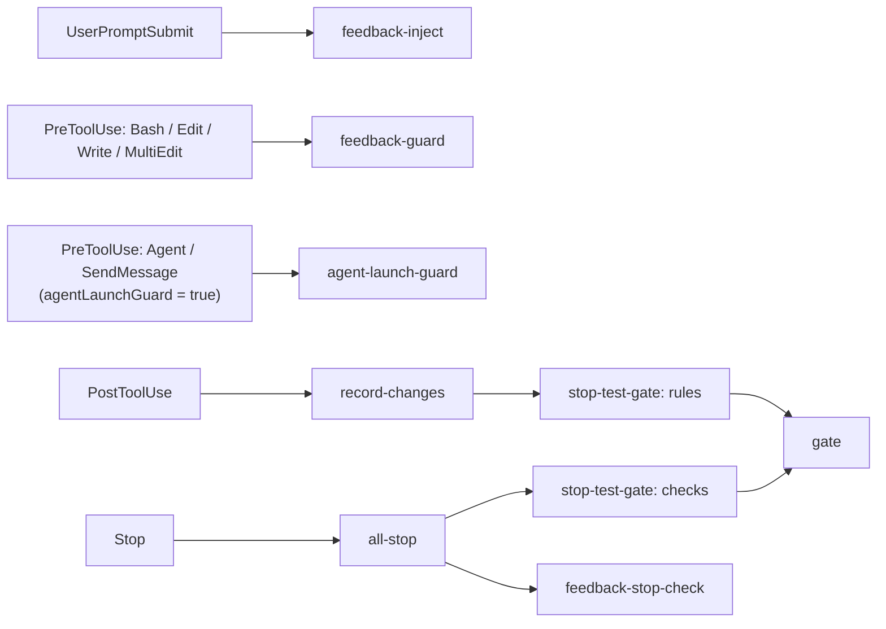

# feedback-gate

[English](README.md)

function hooks で作られた Claude Code プラグインです。次の 3 つを行います。

- フィードバックルール（`~/.claude/feedback/*.md`）を各プロンプトに注入し、ツール呼び出し時と停止時に強制する。
- プロジェクトごとの品質ゲート（lint・テストなど、`.claude/gate.yaml` で定義）を、ファイル編集後と停止時に実行する。
- 確認待ちのときと停止時にデスクトップ通知を出す（macOS）。

## フック

フックは `src/register.ts` で登録され（CI が `hooks/register.js` にバンドルし、それを Claude Code が読み込みます）、`src/` の TypeScript モジュールを呼びます。

| イベント | モジュール | 役割 |
| --- | --- | --- |
| SessionStart | `src/reset-gate.ts` | `startup` / `clear` のときだけ自セッションのゲート状態を消す。resume / compact では消さない。 |
| UserPromptSubmit | `src/rules-file.ts` + `src/feedback-inject.ts` | ルールファイル（`rulesFile` のファイルがあればそれ、無ければ同梱の `rules/feedback_rules.md`）と確定済みフィードバックルール（`count >= 3`）をコンテキストに追加する。 |
| PreToolUse（Bash / Edit / Write / MultiEdit） | `src/feedback-guard.ts` | `pre_bash` / `pre_edit` の enforce を評価し、`count` に応じて deny / ask / warn する。 |
| PostToolUse（Write / Edit / MultiEdit） | `src/record-changes.ts` → `src/stop-test-gate.ts`（`rules`） | 変更ファイルを記録し、`.claude/gate.yaml` の該当ルールを実行する（`src/gate.ts` 経由）。 |
| PreToolUse（Agent / SendMessage）、任意 | `src/agent-launch-guard.ts` | `agentLaunchGuard` が `true` のときだけ有効。サブエージェントへ指示を送る前に、送信本文を見せて確認する。 |
| Notification | `src/notification.ts`（`notify`） | 確認待ちのときにデスクトップ通知（`terminal-notifier` が必要、macOS）。 |
| Stop | `src/all-stop.ts` | ゲートの `checks` フェーズ、`src/feedback-stop-check.ts`、`stop` 通知を順に実行する。 |
| SubagentStop | ゲートの `checks` フェーズ、`src/feedback-stop-check.ts` | サブエージェント向けの同じゲートと `stop_check` ルール。 |

### エージェント起動ガード（任意）

`src/agent-launch-guard.ts` は、`userConfig` の `agentLaunchGuard` を `true` にしたときだけ有効になります（既定は `false`）。有効にすると、`Agent` と `SendMessage` の PreToolUse で `ask` を返し、送信しようとしている本文を確認理由にそのまま載せるので、サブエージェントに渡る前に内容を確認できます。

- `Agent`: `subagent_type` が `code-implementer` のとき、`prompt` を見せて確認する。
- `SendMessage`: 宛先が `git-operator` 以外のとき、`message` を見せて確認する。

どちらにも該当しなければ何も出力せず、通常のパーミッション判定に委ねます。対象のエージェント種別と許可する宛先は `src/agent-launch-guard.ts` 冒頭の `ASK_AGENT_TYPES` / `ALLOW_RECIPIENTS` です。

有効化するには、`/plugin` でインストールするときに表示される設定画面で `agentLaunchGuard` をオンにするか、後から `/config` メニューのこのプラグインの `agentLaunchGuard` の行で切り替えます。



## インストール

```
/plugin install feedback-gate --marketplace nonchan7720/claude-hook-gate
```

マーケットプレイスの追加を聞かれたら `y` と答え、スコープを選択します。

## 前提

インストールするものはありません。フックは素の TypeScript で、1 つの JavaScript にバンドルして Claude Code が直接実行します（Python・bash・jq は不要）。

- `terminal-notifier`（任意、macOS）: デスクトップ通知にだけ必要です。
- `dogwood`（任意。AWS のツールで、ソースは <https://github.com/dogwood-policy/dogwood>）。`cargo install --git https://github.com/dogwood-policy/dogwood amzn-dogwood-cli` でビルド・インストールできます（crate 名は `amzn-dogwood-cli`、バイナリ名は `dogwood`）。`.claude/gate.yaml` の各コマンドを今実行するか後回しにするかの判定に使います。`DOGWOOD_BIN`、`PATH`、`~/.cargo/bin/dogwood`、`~/.local/share/mise/shims/dogwood` の順に探します。見つからない場合、同梱の既定ポリシーが適用されるコマンドは毎回実行され、`policy:` を指定したコマンドは実行されずに後回しになります。

## 読み込むもの

- プロジェクトの `.claude/gate.yaml`（オプトイン。無ければゲートは何もしません）。書式は `scripts/gate.schema.json`、既定ポリシーは `scripts/dogwood/` にあります。
- `~/.claude/feedback/*.md`: frontmatter（`name`、`description`、`type`、`count`、任意で `enforce`）付きのフィードバックルール。`count >= 3` のルールが注入・強制されます。ディレクトリは `CLAUDE_FEEDBACK_DIR` で変更できます。
- ルールファイル: プロンプトごとにコンテキストへ追加されます。既定では同梱の `rules/feedback_rules.md` を使います。丸ごと差し替えるには、`rulesFile` のパス（既定は `~/.claude/feedback-gate/feedback_rules.md`。プラグイン設定で変更可、先頭の `~` は展開されます）に自分のファイルを置いてください。そのファイルがあれば同梱版の代わりに使われます（両方は入りません）。置き場所に `~/.claude/rules/` は避けてください。Claude Code 自身がこのディレクトリを読み込むため、二重に入ってしまいます。

状態ファイル（変更ファイル、試行回数、コマンドのログ）はプロジェクトの `.claude/.gate-status/` 配下に書かれます（`gate.yaml` は従来どおり `.claude/` 直下）。プロジェクトの `.gitignore` に `.claude/.gate-status/` を足してください。旧版が `.claude/` 直下（および `.claude/hooks/logs/`）に残した状態ファイルは、セッション開始時に自動で削除されます。

## 開発

[Bun](https://bun.sh) が必要です。フックのモジュールは Claude Code の中で動き、相対 import と `claude-code` しか解決できないため、`src/` のソース（と `yaml` パッケージ）を `hooks/register.js` にバンドルします。`hooks/hooks.json` はこのバンドルを指します。ファイルやプロセスへのアクセスはすべてエンジンの `$` API（`$.fs`、`$.process`、`$.env`、`$.session`）を、`src/io.ts` の `Io` インターフェース越しに使います。テストは同じコードを Node の `fs` / `child_process` の上で動かします。

```
bun install          # 開発用の依存を入れる
bun run lint         # Biome（lint とフォーマットの検査）。`bun run format` で自動修正
bun run typecheck    # tsc --noEmit
bun run test         # bun test（tests/*.spec.ts）
bun run build        # src/register.ts を hooks/register.js にバンドル
bun run test:plugin  # ビルドしてから、実エンジンで hooks/register.test.ts を実行（`claude` CLI が必要）
```

バンドル `hooks/register.js` は、プルリクエスト上で CI が生成してコミットします。貢献者がコミットする必要はありません（CI が追加するまでリポジトリには入っていません）。「Build bundle」ワークフローが、プルリクエスト（同一リポジトリのブランチ）ごとにバンドルを作り、ファイルの追加または変更があれば `chore: build bundle` コミットをそのブランチへ push します。ローカルで必要なとき（`bun run test:plugin` など）は `bun run build` で作れますが、コミットしないでください。手で編集もしないでください。`scripts/build.ts` は、バンドルが相対パスと `claude-code` 以外を import していたらビルドを失敗させます。

依存には 7 日間のフリーズ期間を設けています。`bunfig.toml` の `minimumReleaseAge` により、`bun install` は公開から 7 日以上経ったバージョンだけを解決します。Dependabot（`.github/dependabot.yml`）も `cooldown` で、npm と GitHub Actions の更新を公開から 7 日経つまで提案しません。Actions はコミット SHA で固定しています。

### リリース

バージョンは [release-please](https://github.com/googleapis/release-please) で管理します。コミットメッセージ（と PR タイトル）は [Conventional Commits](https://www.conventionalcommits.org/ja/)（`feat:`、`fix:`、`refactor:`、`chore:` など）で書いてください。`main` への push ごとに「Release Please」ワークフローがリリース PR を作成・更新し、`package.json`、`.claude-plugin/plugin.json`、`.claude-plugin/marketplace.json` のバージョンを上げて `CHANGELOG.md` を更新します。それをマージするとリリースのタグが付きます。どちらのワークフローも既定の `GITHUB_TOKEN`（PAT は使いません）を使うため、bot が作ったコミットや release-please の PR では CI が自動では起動しません。必須ステータスチェックを設定している場合は、再実行するか空コミットを手で push してください。
